<div align="center">
  
</div>

<div align="center">
  <a href="https://www.linkedin.com/in/pedroart-bm/"></a>
  <a href="mailto:pedroart2611@gmail.com"></a>
</div>

<br />

## `// sobre mim`

Sou **Pedro Artur**, estagiário em Engenharia de Software e estudante de Sistemas de Informação, no Rio de Janeiro — RJ.

Gosto de transformar problemas reais em produtos funcionais: penso no fluxo, modelo o domínio, construo a API, conecto os dados e levo a solução até a operação. Atualmente, meu foco está em sistemas internos, automações, agentes de IA e experiências web que sejam úteis de verdade.

```txt
modo atual: construir produtos de ponta a ponta
foco:      backend · IA aplicada · automações · produto
base:      Rio de Janeiro, Brasil
```

<div align="center">
  
</div>

## `// projeto principal — HERMIX`

### Sistema interno de agentes de IA

O **Hermix** é o principal projeto da minha trajetória até aqui: um sistema interno de agentes de IA criado para centralizar gestão, configuração, testes, versionamento e governança de agentes conectados à OpenAI Responses API, tools, automações e sistemas internos.

Eu desenvolvo o Hermix de ponta a ponta — desde o nome e a identidade visual até a arquitetura, frontend, backend, banco de dados, regras de negócio, segurança e operação.

<table>
  <tr>
    <td width="50%"><b>Construção</b><br />Produto, identidade, UX, frontend, backend e modelagem de dados.</td>
    <td width="50%"><b>Engenharia</b><br />Permissões granulares, auditoria, versionamento, execução segura e integrações.</td>
  </tr>
  <tr>
    <td><b>Stack</b><br />Node.js, Express, React, Vite, Tailwind CSS, PostgreSQL/Neon e OpenAI API.</td>
    <td><b>Operação</b><br />VPS Linux, PM2, Nginx, HTTPS e deploy controlado.</td>
  </tr>
</table>

> O Hermix é um sistema interno e seu código não é público. Por segurança, este perfil apresenta apenas o contexto técnico e as responsabilidades que posso divulgar — sem expor código, credenciais, domínios, IPs ou dados de negócio.

<div align="center">
  <sub>Contribuições privadas podem aparecer de forma anonimizada no gráfico de atividade do GitHub.</sub>
</div>

## `// arsenal técnico`

<div align="center">
  
  <br /><br />
  
  
  
  
  
</div>

## `// projetos públicos`

| Projeto | O que representa |
| --- | --- |
| **Conferência de Cartas** | Um projeto de experimentação e construção de produto em torno de cartas e interação digital. |
| **Unimangas** | Uma aplicação voltada para leitura e organização de mangás, unindo interface, dados e experiência de usuário. |

> Estes projetos mostram meu caminho público. O Hermix representa minha experiência mais completa de engenharia e desenvolvimento de produto.

## `// contato`

Se você quiser conversar sobre engenharia de software, produtos com IA, automações ou construção de sistemas:

<div align="center">
  <a href="https://www.linkedin.com/in/pedroart-bm/">LinkedIn</a>
  ·
  <a href="mailto:pedroart2611@gmail.com">pedroart2611@gmail.com</a>
</div>

<br />

<div align="center">
  
</div>
